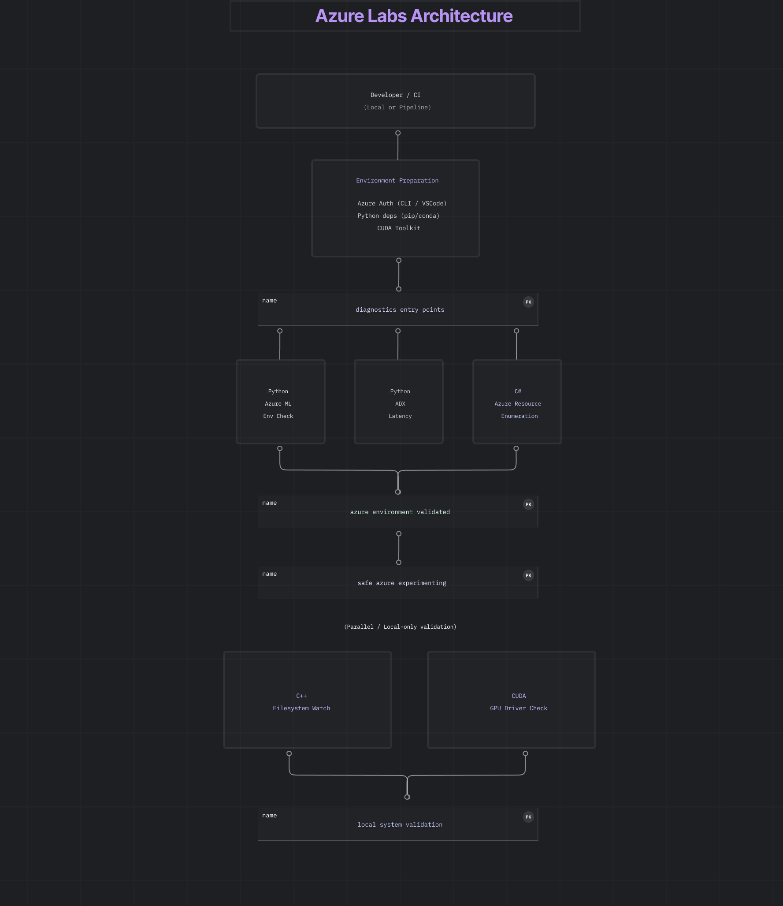

## Azure Labs

Focused on **environment validation**, **resource visibility**, and **latency diagnostics** using Python, C#, C++, and CUDA.

---

## Lab Structure

```text
azure-labs/
 ├─ README.md
 ├─ env/
 │  ├─ requirements.txt
 │  ├─ environment.yml
 │  └─ Dockerfile
 ├─ python/
 │  ├─ adx/
 │  │  └─ query_latency_test.py
 │  └─ ml/
 │     └─ azureml_env_check.py
 ├─ cpp/
 │  └─ filesystem_watcher.cpp
 ├─ csharp/
 │  └─ AzureResourceProbe.cs
 └─ cuda/
    └─ gpu_driver_check.cu
```
## Environment Preparation

Authenticate with Azure:

- Use Azure CLI or Visual Studio Code account sign-in.

- Verify with az account show.

CUDA samples require:
- NVIDIA GPU
- CUDA Toolkit installed and on `PATH`
CUDA components are optional and not required to run the core Azure labs.

Set required variables:

- AZURE_SUBSCRIPTION_ID

Install Python dependencies:

```text
pip install -r env/requirements.txt
```
Conda Setup

```text
conda env create -f env/environment.yml
conda activate azure-labs
```
## Run Diagnostics
Azure Resource Access (Python)

```text
python python/ml/azureml_env_check.py
```

Azure Data Explorer (ADX) Latency

```text
python python/adx/query_latency_test.py
```

Azure Resource Enumeration (C#)
```text
dotnet run --project csharp/AzureResourceProbe.c
```

Filesystem Monitoring (C++)
```text
g++ filesystem_watcher.cpp -std=c++17 -o watcher
./watcher
```
---
Notes

- CUDA examples require GPU-enabled Azure VMs.
- Authentication uses DefaultAzureCredential.
- Keyboard shortcuts in Visual Studio Code should reference command IDs, e.g. kb(workbench.action.showCommands).
- Include Fixes #<number> in PRs for traceability.