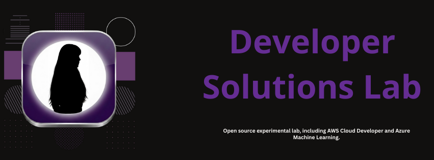

---
## Open Source Developer Solutions Lab

This repository is an experimental lab focused on **reproducible developer solutions**.  
It documents real technical problems and validated approaches across **CI/CD, cloud infrastructure, and tooling**.

The goal is learning through practice: understand *why* issues happen, *how* to reproduce them, and *how* to resolve them responsibly.

---

## Scope

This project may include experiments and examples involving:
- CI/CD pipelines (GitHub Actions, Docker)
- Cloud platforms (Azure, AWS)
- Local development and testing environments

All content is provided for **educational and experimental purposes**.

---

## Getting Involved

Contributions are welcome and evaluated based on:
- Reproducibility
- Technical clarity
- Explicit assumptions and limitations

How to contribute:
- Check issues labeled **good first issue**
- Submit pull requests with clear descriptions
- Use issues for discussion and questions

> Please use GitHub issues and pull requests as the primary communication channels.

---

## Project Structure

- `solutions/` – Documented technical solutions and experiments  
- `aws-labs/` – AWS-focused experiments  
- `azure-labs/` – Azure-focused experiments  
- `apps/` – Sample applications used for testing and validation  

---

## Maintainer

Maintained by **DakotaB75** as an independent open-source contributor.

This is a personal learning and experimentation project.  
There is no official support, SLA, or guaranteed stability.

---

## License

This project is licensed under the MIT License.  
See the LICENSE file for details.